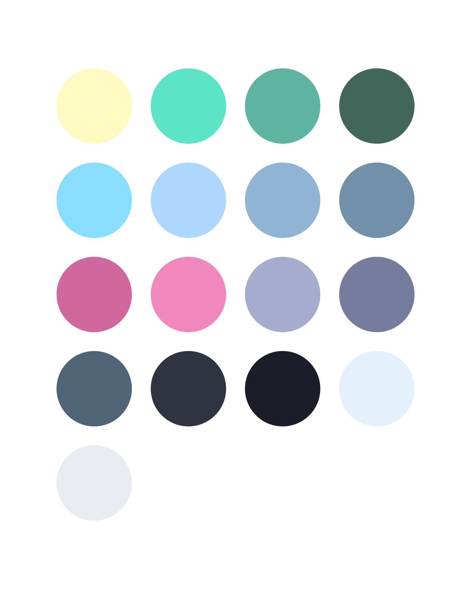

  
  

Poimandres contrast is a minimal dark-theme based on [poimandres](https://github.com/drcmda/poimandres-theme). This theme tries to focus on semantic meaning instead of color variety. You'll find that it colors things like errors, voids, throws and deletes in red, types are slighty darker so that the spotlight is on the code, green new's, etc.

This contrast version uses the workspace colors and background from Dark Modern (the default VS Code theme). The syntax highlighting comes from poimandres. This makes for a nice, readable theme with minimal syntax highlighting.
